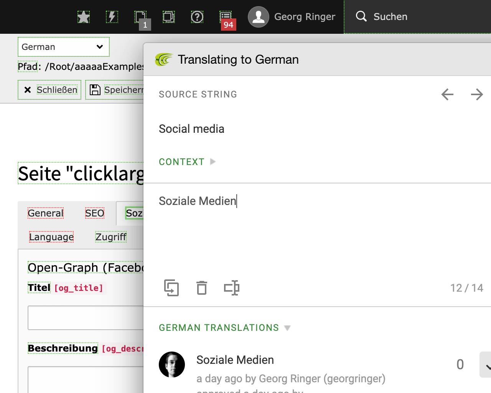

# TYPO3 extension `crowdin`

This extensions enables the **In-Context Localization** feature of Crowdin for
TYPO3. Be aware that this requires the usage of the new translation server which
is currently in beta state!

|                  | URL                                                         |
|------------------|-------------------------------------------------------------|
| **Repository:**  | https://github.com/FriendsOfTYPO3/crowdin                   |
| **Read online:** | https://docs.typo3.org/p/friendsoftypo3/crowdin/main/en-us/ |
| **TER:**         | https://extensions.typo3.org/extension/crowdin/             |
